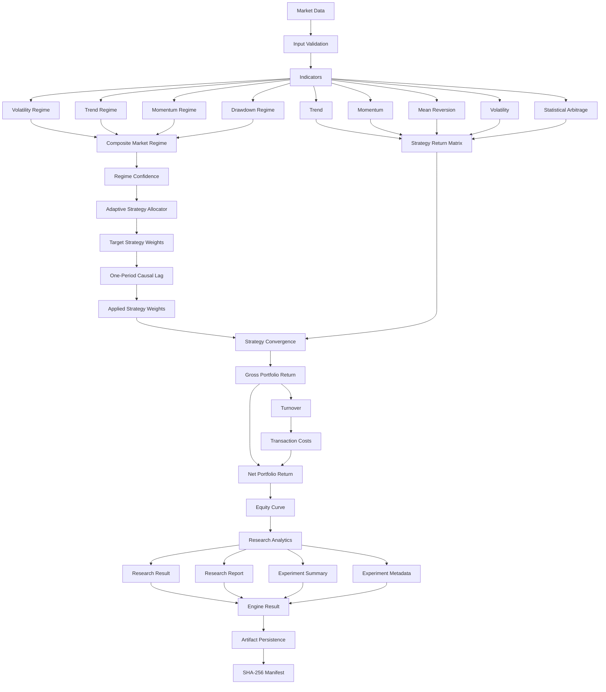
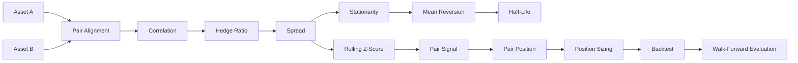

````markdown
<div align="center">

# ◈ SYSTEM ARCHITECTURE

## ALGORITHMIC TRADING ENGINE

### Regime Intelligence • Adaptive Allocation • Portfolio Engineering • Quantitative Research

**Architecture Specification — v1.0**

> A modular, deterministic and causality-aware architecture for systematic quantitative research across changing financial market regimes.

</div>

---

# 01 ◇ ARCHITECTURAL VISION

The **Algorithmic Trading Engine** is designed as a layered quantitative research framework that connects market data, systematic strategies, regime intelligence, adaptive portfolio allocation, execution modelling, research analytics and reproducible experiment infrastructure.

The system is built around a fundamental architectural principle:

> **Market information should flow forward through explicit quantitative layers without allowing future information to leak backward into historical decisions.**

At the highest level:

```text
MARKET DATA
     │
     ▼
QUANTITATIVE TRANSFORMATION
     │
     ▼
STRATEGY INTELLIGENCE
     │
     ├────────────────────────────┐
     │                            │
     ▼                            ▼
MARKET REGIME              STATISTICAL ARBITRAGE
INTELLIGENCE                     │
     │                            │
     └──────────────┬─────────────┘
                    ▼
          ADAPTIVE ALLOCATION
                    │
                    ▼
          CAUSAL CONVERGENCE
                    │
                    ▼
            EXECUTION COSTS
                    │
                    ▼
           PORTFOLIO RETURNS
                    │
                    ▼
          RESEARCH ANALYTICS
                    │
                    ▼
        PRODUCTION INTERFACE
                    │
                    ▼
       REPRODUCIBLE ARTIFACTS
````

The architecture deliberately separates responsibilities so that individual quantitative components remain:

* testable,
* deterministic,
* replaceable,
* reusable,
* independently interpretable.

---

# 02 ◇ CORE DESIGN PRINCIPLES

The engine follows seven major architectural principles.

## 2.1 — Modularity

Market indicators, strategies, portfolio optimization, regime detection, research analytics and production infrastructure are maintained as separate domains.

A change in one subsystem should not require redesigning unrelated components.

---

## 2.2 — Causality

Historical portfolio decisions must only use information available at the time the decision could have been made.

The adaptive system therefore enforces:

```text
INFORMATION[t]
      │
      ▼
DECISION[t]
      │
      ▼
ONE-PERIOD LAG
      │
      ▼
APPLICATION[t+1]
```

This boundary is central to the architecture.

---

## 2.3 — Determinism

Given equivalent deterministic inputs and configuration, the engine should reproduce equivalent quantitative output.

Determinism supports:

* experiment comparison,
* debugging,
* regression testing,
* reproducible research.

---

## 2.4 — Separation of Concerns

The engine separates:

```text
SIGNAL GENERATION
        ≠
PORTFOLIO ALLOCATION
        ≠
EXECUTION
        ≠
PERFORMANCE ANALYSIS
        ≠
RESEARCH REPORTING
```

This prevents strategy logic from becoming tightly coupled to execution or reporting assumptions.

---

## 2.5 — Defensive Validation

Malformed input should fail explicitly rather than silently contaminate research results.

Production validation therefore checks:

* data types,
* timestamps,
* ordering,
* uniqueness,
* alignment,
* missing values,
* finite numerical values,
* positive prices,
* strategy structure.

---

## 2.6 — Reproducibility

Research results should be identifiable after execution.

The architecture therefore includes:

```text
Configuration
     ↓
Fingerprint
     ↓
Experiment ID
     ↓
Serialized Artifacts
     ↓
SHA-256 Manifest
```

---

## 2.7 — Testability

Quantitative infrastructure is treated as software infrastructure.

The architecture supports testing from individual functions through complete CLI execution.

```text
UNIT
  ↓
MODULE
  ↓
INTEGRATION
  ↓
PUBLIC API
  ↓
PRODUCTION
  ↓
END-TO-END
```

---

# 03 ◇ GLOBAL SYSTEM ARCHITECTURE



---

# 04 ◇ PACKAGE TOPOLOGY

```text
src/
└── trading_engine/
    │
    ├── backtest/
    ├── data/
    ├── execution/
    ├── indicators/
    ├── performance/
    ├── portfolio/
    ├── production/
    ├── regime/
    ├── research/
    ├── risk/
    ├── stat_arb/
    ├── strategies/
    ├── __init__.py
    └── __main__.py
```

Responsibilities:

| Package       | Responsibility                                 |
| ------------- | ---------------------------------------------- |
| `indicators`  | Market transformations and statistics          |
| `strategies`  | Systematic trading logic                       |
| `stat_arb`    | Pairs trading and relative-value research      |
| `backtest`    | Event-driven simulation                        |
| `execution`   | Commission, slippage, liquidity and impact     |
| `portfolio`   | Portfolio construction and optimization        |
| `risk`        | Tail and portfolio risk analytics              |
| `performance` | Return and drawdown analytics                  |
| `regime`      | Market-state inference and adaptive allocation |
| `research`    | Attribution, diagnostics and reporting         |
| `production`  | Stable execution, CLI and artifacts            |

---

# 05 ◇ DATA ARCHITECTURE

The production pipeline operates on aligned financial time series.

Primary inputs:

```text
PRICE SERIES
STRATEGY RETURN MATRIX
BENCHMARK RETURN SERIES
ENGINE CONFIGURATION
```

## 5.1 — Prices

```text
DatetimeIndex → Price
```

Example:

```text
2026-01-01    100.00
2026-01-02    100.42
2026-01-03    101.05
```

Prices are used for:

* regime detection,
* volatility analysis,
* trend analysis,
* momentum analysis,
* drawdown analysis.

## 5.2 — Strategy Returns

```text
date        trend   momentum   mean_reversion   volatility   stat_arb
2026-01-01  0.001   0.002      -0.001           0.0005       0.0008
2026-01-02  0.003   0.001       0.0004          -0.0002       0.0011
```

For `n` strategies:

```text
r_t = [r₁,t, r₂,t, ... , rₙ,t]
```

## 5.3 — Benchmark

The optional benchmark return series must align exactly with the research timeline.

---

# 06 ◇ INPUT VALIDATION BOUNDARY

Production execution begins with validation.

```text
RAW INPUT
    │
    ▼
TYPE VALIDATION
    │
    ▼
INDEX VALIDATION
    │
    ▼
NUMERICAL VALIDATION
    │
    ▼
ALIGNMENT VALIDATION
    │
    ▼
RESEARCH PIPELINE
```

Validation checks include:

* DatetimeIndex,
* unique timestamps,
* increasing timestamps,
* matching indexes,
* finite numerical values,
* strictly positive prices,
* valid strategy names,
* benchmark alignment,
* sufficient observations,
* missing-data policy.

---

# 07 ◇ INDICATOR ARCHITECTURE

The indicator layer converts raw observations into reusable quantitative features.

Supported transformations include:

* simple returns,
* logarithmic returns,
* cumulative returns,
* wealth index,
* rolling mean,
* rolling standard deviation,
* rolling z-score,
* historical volatility,
* EWMA volatility,
* Parkinson volatility,
* downside volatility,
* rolling covariance,
* rolling correlation,
* rolling beta.

Conceptually:

```text
RAW MARKET DATA
      │
      ▼
QUANTITATIVE TRANSFORMATION
      │
      ▼
REUSABLE INDICATOR SERIES
```

---

# 08 ◇ STRATEGY ARCHITECTURE

The strategy layer represents independent systematic strategy logic.

Core strategy families include:

```text
TREND
MOMENTUM
MEAN REVERSION
VOLATILITY
STATISTICAL ARBITRAGE
```

A strategy can be evaluated:

```text
Standalone
   │
   ├── Individual Backtest
   ├── Static Portfolio
   └── Adaptive Portfolio
```

---

# 09 ◇ EVENT-DRIVEN BACKTEST ARCHITECTURE

```text
MarketEvent
     │
     ▼
Strategy
     │
     ▼
SignalEvent
     │
     ▼
Portfolio
     │
     ▼
OrderEvent
     │
     ▼
ExecutionModel
     │
     ▼
FillEvent
     │
     ▼
Portfolio Update
```

This architecture separates:

* market information,
* signal generation,
* portfolio decisions,
* order generation,
* execution assumptions,
* fill processing.

---

# 10 ◇ EXECUTION ARCHITECTURE

The execution layer models trading friction.

Core concepts include:

```text
COMMISSIONS
SLIPPAGE
LIQUIDITY
MARKET IMPACT
```

The separation is intentional:

> Strategy logic determines what to trade; execution logic determines how trading is simulated.

---

# 11 ◇ PORTFOLIO ENGINEERING

Supported portfolio methods include:

```text
Equal Weight
Minimum Variance
Bounded Minimum Variance
Maximum Sharpe
Risk Parity
Black-Litterman
Turnover-Constrained Allocation
```

Portfolio analytics include:

* portfolio variance,
* portfolio volatility,
* marginal risk contributions,
* percentage risk contributions,
* diversification ratio,
* diversification gain,
* effective number of assets,
* effective number of risk bets,
* weight concentration,
* turnover.

---

# 12 ◇ RISK ARCHITECTURE

Risk functionality includes:

```text
Historical VaR
Historical CVaR
Portfolio Volatility
Risk Contribution
Marginal Risk Contribution
Percentage Risk Contribution
Risk Concentration
```

The risk subsystem is independent of strategy-generation logic.

---

# 13 ◇ PERFORMANCE ARCHITECTURE

Performance analytics include:

```text
Annualized Return
CAGR
Sharpe Ratio
Sortino Ratio
Calmar Ratio
Maximum Drawdown
Drawdown Duration
Underwater Curve
Tracking Error
Information Ratio
```

---

# 14 ◇ STATISTICAL ARBITRAGE ARCHITECTURE



The subsystem supports:

* pair alignment,
* price correlation,
* pair log returns,
* hedge-ratio estimation,
* rolling hedge ratios,
* expanding hedge ratios,
* spread construction,
* rolling z-score,
* stationarity diagnostics,
* Engle-Granger diagnostics,
* mean-reversion analysis,
* half-life estimation,
* pair sizing,
* pair backtesting,
* walk-forward analysis.

---

# 15 ◇ MARKET-REGIME INTELLIGENCE

The regime layer interprets market state using multiple dimensions.

```text
                     MARKET HISTORY
                           │
           ┌───────────────┼───────────────┐
           │               │               │
           ▼               ▼               ▼
      VOLATILITY         TREND          MOMENTUM
           │               │               │
           └───────────────┼───────────────┘
                           │
                           ▼
                       DRAWDOWN
                           │
                           ▼
                  COMPOSITE REGIME
                           │
                           ▼
                       CONFIDENCE
```

---

# 16 ◇ VOLATILITY REGIME

```text
Returns
   │
   ▼
Rolling Volatility
   │
   ▼
Historical Thresholds
   │
   ├── LOW
   ├── NORMAL
   └── HIGH
```

---

# 17 ◇ TREND REGIME

Trend classification describes directional persistence.

Typical conceptual states:

```text
BULL
SIDEWAYS
BEAR
```

---

# 18 ◇ MOMENTUM REGIME

A simplified momentum measure is:

```text
M_t = P_t / P_(t-k) - 1
```

where `k` is the momentum lookback.

---

# 19 ◇ DRAWDOWN REGIME

Running peak:

```text
Peak_t = max(P_0, ..., P_t)
```

Drawdown:

```text
DD_t = P_t / Peak_t - 1
```

This captures market stress that may not be fully represented by trend or volatility.

---

# 20 ◇ COMPOSITE REGIME

Conceptually:

```text
R_t =
f(
    Volatility_t,
    Trend_t,
    Momentum_t,
    Drawdown_t
)
```

Example states:

```text
LOW_VOL_BULL
NORMAL_VOL_BULL
HIGH_VOL_BEAR
NORMAL_VOL_SIDEWAYS
HIGH_VOL_SIDEWAYS
```

---

# 21 ◇ REGIME CONFIDENCE

```text
Confidence_t ∈ [0, 1]
```

Confidence can control the strength of adaptive allocation.

High confidence:

```text
STRONGER REGIME TILT
```

Low confidence:

```text
MORE CONSERVATIVE ALLOCATION
```

---

# 22 ◇ ADAPTIVE STRATEGY ALLOCATION

```text
COMPOSITE REGIME
       +
REGIME CONFIDENCE
       +
BASE ALLOCATION
       │
       ▼
REGIME PREFERENCE MAP
       │
       ▼
RAW STRATEGY WEIGHTS
       │
       ▼
NORMALIZATION
       │
       ▼
EXPOSURE CONSTRAINT
       │
       ▼
TURNOVER CONSTRAINT
       │
       ▼
TARGET STRATEGY WEIGHTS
```

---

# 23 ◇ EXPOSURE CONTROL

The allocator supports:

```text
minimum_exposure
maximum_exposure
```

Conceptually:

```text
minimum_exposure
        ≤
gross_exposure
        ≤
maximum_exposure
```

---

# 24 ◇ CASH EXPOSURE

If gross strategy exposure is less than 100%:

```text
Cash Weight = 1 - Invested Weight
```

This allows defensive portfolio states.

---

# 25 ◇ TURNOVER CONTROL

A conceptual turnover measure is:

```text
T_t = 0.5 × Σ |w_i,t - w_i,t-1|
```

A configured maximum turnover limits abrupt reallocation.

```text
DESIRED PORTFOLIO
       │
       ▼
COMPARE WITH CURRENT
       │
       ▼
TURNOVER REQUIRED
       │
       ▼
EXCEEDS LIMIT?
   │           │
  NO          YES
   │           │
   ▼           ▼
ACCEPT      SCALE MOVE
```

---

# 26 ◇ CAUSAL CONVERGENCE

The convergence layer links market-state intelligence to realized portfolio returns.

```text
REGIME[t]
    │
    ▼
ALLOCATOR
    │
    ▼
TARGET WEIGHTS[t]
    │
    ▼
────────────────────────
    CAUSAL BOUNDARY
────────────────────────
    │
    ▼
ONE-PERIOD SHIFT
    │
    ▼
APPLIED WEIGHTS[t+1]
    │
    ├───────────────────┐
    │                   │
    ▼                   ▼
WEIGHT VECTOR      STRATEGY RETURNS
    │                   │
    └──────────┬────────┘
               ▼
        PORTFOLIO RETURN
```

---

# 27 ◇ LOOKAHEAD PROTECTION

The core causal relationship is:

```text
w_applied,t = w_target,t-1
```

The architecture prevents:

```text
Regime calculated using return[t]
             ↓
Weight selected from that regime
             ↓
Weight earning return[t]
```

Instead:

```text
Information[t]
      ↓
Decision[t]
      ↓
Application[t+1]
```

---

# 28 ◇ GROSS PORTFOLIO RETURN

For `n` strategies:

```text
R_gross,t =
Σ(i=1...n)
w_i,t × r_i,t
```

---

# 29 ◇ TRANSACTION COSTS

```text
Cost_t =
Turnover_t × CostRate
```

Net return:

```text
R_net,t =
R_gross,t - Cost_t
```

The system separately preserves:

```text
gross_returns
transaction_costs
net_returns
turnover
```

---

# 30 ◇ EQUITY CURVE

Portfolio equity evolves through geometric compounding.

```text
E_t =
E_(t-1)
×
(1 + R_net,t)
```

---

# 31 ◇ RESEARCH ARCHITECTURE

```text
                  RESEARCH RESULT
                        │
       ┌────────────────┼────────────────┐
       │                │                │
       ▼                ▼                ▼
   BENCHMARK         STRATEGY          REGIME
   ANALYSIS         ATTRIBUTION       ANALYSIS
       │                │                │
       └────────────────┼────────────────┘
                        │
          ┌─────────────┼─────────────┐
          │             │             │
          ▼             ▼             ▼
      ROLLING       DRAWDOWN        COST
      METRICS       DIAGNOSTICS   DIAGNOSTICS
          │             │             │
          └─────────────┼─────────────┘
                        ▼
                 RESEARCH REPORT
```

---

# 32 ◇ RESEARCH RESULT

`ResearchResult` contains:

```text
equity_curve
returns
gross_returns
regime_frame
target_weights
applied_weights
turnover
transaction_costs
```

---

# 33 ◇ BENCHMARK ANALYSIS

When benchmark returns are supplied, the engine can calculate:

* portfolio total return,
* benchmark total return,
* excess return,
* portfolio volatility,
* benchmark volatility,
* tracking error,
* information ratio.

---

# 34 ◇ STRATEGY ATTRIBUTION

```text
Contribution_i,t =
Weight_i,t × Return_i,t
```

Contributions are aggregated through time to rank strategy impact.

---

# 35 ◇ REGIME ATTRIBUTION

For each regime, the research layer can calculate:

```text
Observations
Average Return
Cumulative Return
Volatility
Win Rate
```

---

# 36 ◇ ROLLING DIAGNOSTICS

The research layer includes:

```text
Rolling Annualized Volatility
Rolling Sharpe Ratio
```

---

# 37 ◇ DRAWDOWN DIAGNOSTICS

Research diagnostics include:

```text
Maximum Drawdown
Maximum Drawdown Duration
Current Drawdown
Current Drawdown Duration
```

---

# 38 ◇ COST DIAGNOSTICS

Cost diagnostics include:

```text
Total Transaction Cost
Average Transaction Cost
Maximum Transaction Cost
Total Turnover
Average Turnover
Cost / Gross Return Ratio
```

---

# 39 ◇ STRATEGY RANKING

```text
STRATEGY CONTRIBUTIONS
         │
         ▼
AGGREGATE THROUGH TIME
         │
         ▼
SORT
         │
         ▼
STRATEGY RANKING
```

---

# 40 ◇ REGIME RANKING

```text
REGIME RETURNS
      │
      ▼
AGGREGATE
      │
      ▼
COMPARE
      │
      ▼
REGIME RANKING
```

---

# 41 ◇ EXPERIMENT METADATA

```text
ExperimentMetadata
│
├── experiment_id
├── config_fingerprint
├── created_at
├── observations
└── strategy_count
```

---

# 42 ◇ CONFIGURATION FINGERPRINT

```text
ResearchConfig
      │
      ▼
Canonical Representation
      │
      ▼
Stable Serialization
      │
      ▼
SHA-256
      │
      ▼
Configuration Fingerprint
```

---

# 43 ◇ EXPERIMENT IDENTIFIER

```text
CONFIGURATION FINGERPRINT
          +
OBSERVATION COUNT
          +
STRATEGY COUNT
          │
          ▼
        SHA-256
          │
          ▼
     EXPERIMENT ID
```

---

# 44 ◇ PRODUCTION ARCHITECTURE

Primary interface:

```python
from trading_engine import EngineConfig, run_engine
```

Flow:

```text
EngineConfig
     │
     ▼
Input Validation
     │
     ▼
run_engine()
     │
     ▼
Research Execution
     │
     ▼
ResearchResult
     │
     ├── ResearchReport
     ├── ExperimentSummary
     └── ExperimentMetadata
                │
                ▼
           EngineResult
```

---

# 45 ◇ ENGINE RESULT

```text
EngineResult
│
├── ResearchResult
├── ResearchReport
├── ExperimentSummary
└── ExperimentMetadata
```

This provides a single production-facing aggregate.

---

# 46 ◇ PUBLIC API BOUNDARY

```text
USER CODE
    │
    ▼
trading_engine PUBLIC API
    │
    ▼
PRODUCTION ORCHESTRATION
    │
    ▼
INTERNAL SUBSYSTEMS
```

Production users should normally import from the top-level package.

---

# 47 ◇ COMMAND-LINE ARCHITECTURE

Entry point:

```powershell
python -m trading_engine
```

Flow:

```text
CSV INPUTS
   │
   ▼
CLI LOADER
   │
   ▼
EngineConfig
   │
   ▼
run_engine()
   │
   ▼
EngineResult
   │
   ▼
Artifact Persistence
```

Supported command families:

```text
run
verify
```

---

# 48 ◇ ARTIFACT ARCHITECTURE

Persisted experiment structure:

```text
artifacts/
└── <experiment-id>/
    ├── metadata.json
    ├── result.json
    ├── report.json
    ├── summary.json
    └── manifest.json
```

---

# 49 ◇ SHA-256 INTEGRITY

```text
metadata.json ─── SHA-256 ───┐
                             │
result.json ───── SHA-256 ────┤
                             │
report.json ───── SHA-256 ────┼──► manifest.json
                             │
summary.json ──── SHA-256 ────┘
```

Verification recalculates checksums and compares them with the manifest.

---

# 50 ◇ REPRODUCIBILITY CHAIN

```text
INPUT DATA
    │
    ▼
CONFIGURATION
    │
    ▼
CONFIG FINGERPRINT
    │
    ▼
EXPERIMENT ID
    │
    ▼
ENGINE EXECUTION
    │
    ▼
ENGINE RESULT
    │
    ▼
SERIALIZATION
    │
    ▼
ARTIFACT DIRECTORY
    │
    ▼
SHA-256 MANIFEST
```

---

# 51 ◇ TESTING ARCHITECTURE

```text
UNIT TESTS
    │
    ▼
SUBSYSTEM TESTS
    │
    ▼
CROSS-MODULE TESTS
    │
    ▼
PUBLIC API TESTS
    │
    ▼
PRODUCTION TESTS
    │
    ▼
END-TO-END ENGINE TESTS
    │
    ▼
END-TO-END CLI TESTS
```

Current v1.0 quality baseline:

```text
Automated Tests       : 1,330 passing
Total Coverage        : 95.76%
Required Coverage     : ≥ 95.00%
Branch Coverage       : Enabled
Static Analysis       : Ruff
Formatting            : Ruff Format
```

---

# 52 ◇ RELEASE QUALITY GATE

```text
SOURCE CODE
    │
    ▼
RUFF CHECK
    │
    ▼
FORMAT CHECK
    │
    ▼
PYTEST
    │
    ▼
BRANCH COVERAGE
    │
    ▼
PUBLIC API TESTS
    │
    ▼
PRODUCTION TESTS
    │
    ▼
END-TO-END TESTS
    │
    ▼
RELEASE CANDIDATE
```

---

# 53 ◇ FAILURE PHILOSOPHY

The engine follows a fail-explicitly model.

Preferred behaviour:

```text
INVALID STATE
      │
      ▼
CLEAR EXCEPTION
```

Avoided behaviour:

```text
INVALID STATE
      │
      ▼
SILENT COERCION
      │
      ▼
MISLEADING RESULT
```

This is especially important in quantitative software.

---

# 54 ◇ CURRENT v1.0 SYSTEM BOUNDARY

Included:

```text
✓ market indicators
✓ systematic strategies
✓ statistical arbitrage
✓ portfolio optimization
✓ risk analytics
✓ event-driven backtesting
✓ execution modelling
✓ regime detection
✓ adaptive allocation
✓ causal convergence
✓ transaction costs
✓ research analytics
✓ production API
✓ CLI
✓ artifact persistence
✓ SHA-256 integrity verification
```

Not currently included:

```text
× live broker connectivity
× live exchange connectivity
× real-money order routing
× FIX connectivity
× colocated execution
× broker credential management
× full tick-level exchange simulation
```

The v1.0 system is intentionally research-first.

---

# 55 ◇ FUTURE EXTENSION PATH

The architecture can support future modules such as:

```text
CURRENT ENGINE
      │
      ├── Live Market Data
      ├── Broker APIs
      ├── Database Layer
      ├── Paper Trading
      ├── Risk Governor
      ├── Monitoring
      ├── Strategy Health Checks
      └── Distributed Execution
```

Potential future enhancements include:

* broker adapters,
* real-time feeds,
* persistent experiment registries,
* live risk controls,
* strategy degradation detection,
* paper trading,
* kill switches,
* asynchronous execution,
* observability,
* dashboards,
* deployment infrastructure.

---

# 56 ◇ COMPLETE SYSTEM FLOW

```text
┌──────────────────────────────────────────────────────┐
│                     MARKET DATA                      │
└──────────────────────────┬───────────────────────────┘
                           │
                           ▼
┌──────────────────────────────────────────────────────┐
│                  INPUT VALIDATION                    │
└──────────────────────────┬───────────────────────────┘
                           │
                           ▼
┌──────────────────────────────────────────────────────┐
│                     INDICATORS                       │
└──────────────┬─────────────────────────┬─────────────┘
               │                         │
               ▼                         ▼
┌─────────────────────────┐   ┌─────────────────────────┐
│       STRATEGIES        │   │     REGIME ANALYSIS     │
│                         │   │                         │
│ Trend                   │   │ Volatility              │
│ Momentum                │   │ Trend                   │
│ Mean Reversion          │   │ Momentum                │
│ Volatility              │   │ Drawdown                │
│ Statistical Arbitrage   │   │ Composite Regime        │
└────────────┬────────────┘   └────────────┬────────────┘
             │                             │
             │                             ▼
             │                  ┌──────────────────────┐
             │                  │ ADAPTIVE ALLOCATOR   │
             │                  └──────────┬───────────┘
             │                             │
             │                             ▼
             │                  ┌──────────────────────┐
             │                  │   TARGET WEIGHTS     │
             │                  └──────────┬───────────┘
             │                             │
             │                             ▼
             │                  ┌──────────────────────┐
             │                  │    CAUSAL SHIFT      │
             │                  └──────────┬───────────┘
             │                             │
             └──────────────┬──────────────┘
                            ▼
                 ┌──────────────────────┐
                 │   APPLIED WEIGHTS    │
                 └──────────┬───────────┘
                            │
                            ▼
                 ┌──────────────────────┐
                 │ PORTFOLIO CONVERGENCE│
                 └──────────┬───────────┘
                            │
                            ▼
                 ┌──────────────────────┐
                 │    GROSS RETURN      │
                 └──────────┬───────────┘
                            │
                            ▼
                 ┌──────────────────────┐
                 │ TURNOVER + COSTS     │
                 └──────────┬───────────┘
                            │
                            ▼
                 ┌──────────────────────┐
                 │      NET RETURN      │
                 └──────────┬───────────┘
                            │
                            ▼
                 ┌──────────────────────┐
                 │      EQUITY CURVE    │
                 └──────────┬───────────┘
                            │
                            ▼
                 ┌──────────────────────┐
                 │  RESEARCH ANALYTICS  │
                 └──────────┬───────────┘
                            │
              ┌─────────────┼─────────────┐
              │             │             │
              ▼             ▼             ▼
         ATTRIBUTION    DIAGNOSTICS    RANKINGS
              │             │             │
              └─────────────┼─────────────┘
                            ▼
                 ┌──────────────────────┐
                 │     ENGINE RESULT    │
                 └──────────┬───────────┘
                            │
                            ▼
                 ┌──────────────────────┐
                 │ ARTIFACT PERSISTENCE │
                 └──────────┬───────────┘
                            │
                            ▼
                 ┌──────────────────────┐
                 │ SHA-256 VERIFICATION │
                 └──────────────────────┘
```

---

# 57 ◇ ARCHITECTURAL SUMMARY

The engine is not centered around one trading strategy.

It is centered around a **quantitative research architecture**.

The complete philosophy is:

```text
OBSERVE
   ↓
TRANSFORM
   ↓
MODEL
   ↓
CLASSIFY
   ↓
ALLOCATE
   ↓
LAG
   ↓
CONVERGE
   ↓
ACCOUNT FOR COST
   ↓
MEASURE
   ↓
ATTRIBUTE
   ↓
PERSIST
   ↓
VERIFY
```

The v1.0 architecture combines:

```text
Regime Intelligence
        ×
Multi-Strategy Allocation
        ×
Causal Convergence
        ×
Portfolio Engineering
        ×
Transaction-Cost Awareness
        ×
Research Attribution
        ×
Reproducible Experimentation
```

---

<div align="center">

# ◈ ALGORITHMIC TRADING ENGINE

### SYSTEM ARCHITECTURE — v1.0

**MARKET INTELLIGENCE × ADAPTIVE CAPITAL × QUANTITATIVE ENGINEERING**

`DATA → REGIME → ALLOCATION → CONVERGENCE → RESEARCH → REPRODUCIBILITY`

</div>
```
